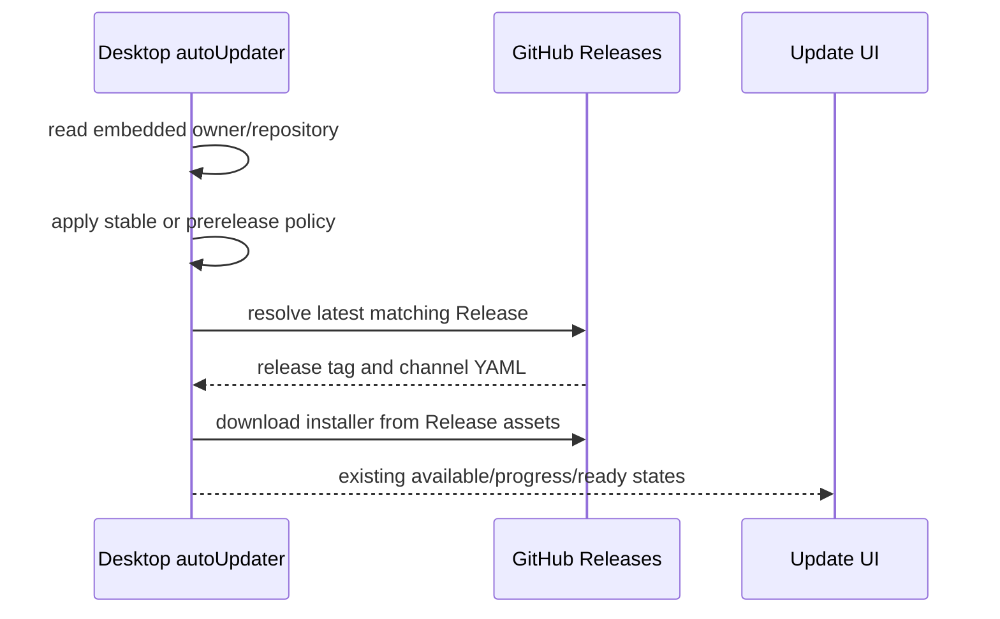

# GitHub Release 桌面自动更新

## 产品规则

- 正式桌面应用只从公开仓库 `railzen/ZCode` 的 GitHub Releases 检查更新，不再请求 ZCode 服务端的 Electron manifest API。
- 稳定通道只接受 GitHub 正式 Release；开启“接受提前收到预览版更新”时允许 GitHub prerelease，继续复用 electron-updater 的 channel 文件规则。
- 客户端不携带 GitHub Token，因此更新仓库必须公开。检查失败时展示既有更新错误，不回退旧服务端。
- Windows Release 必须同时包含 NSIS `.exe` 和 `latest.yml`；GitHub provider 通过 `latest.yml` 解析版本和安装包。

## 状态与边界

- `autoUpdater.ts` 继续是更新检查、下载、取消、安装和 UI 状态的唯一 owner；本次只替换它使用的 provider。
- GitHub Release 及其资产是远端版本事实的唯一来源。服务端 endpoint、设备 ID 和 ZCode release channel API 不再参与桌面更新检查。
- GitHub 仓库身份由主进程更新适配器固定；正式包忽略运行时环境变量或命令行对更新仓库的改写，避免已发布客户端被本地环境劫持到其他仓库。
- `electron-builder` 只生成安装包和更新元数据，不拥有 GitHub 发布权。GitHub Actions 的 Release job 是 Tag、Release 和附件上传的唯一写入路径。
- Release Tag 是发布幂等键，安装包版本和 Tag 版本必须一致。

## 事件顺序

启动时立即检查一次，之后沿用每小时轮询和手动检查入口。一次检查仍使用现有 generation/in-flight 防重；切换预览设置时，当前请求完成后再按新通道重查，旧结果不能覆盖新通道状态。

## 失败语义

- GitHub 无 Release、网络失败、限流或 channel YAML 缺失：检查失败并沿用现有错误状态，不查询旧 manifest API。
- 打包阶段不得因 CI 环境而隐式发布；如果打包工具尝试写入 GitHub，则视为发布边界违反并中止流程。
- Release 缺少 `.exe` 或 `latest.yml`：发布 workflow 在创建 Tag/Release 前失败。
- 下载校验、取消、缓存命中和 Windows 显式安装语义保持不变，继续由 electron-updater 和现有状态机处理。

## 验收场景

1. `railzen/ZCode` 最新正式 Release 高于本地版本且资产完整：客户端显示可更新并可下载安装。
2. 最新 Release 等于或低于本地版本：客户端显示已是最新版本。
3. 只有 prerelease 更高：稳定通道忽略；开启预览更新后可见。
4. GitHub Release 缺少 `latest.yml`：发布任务失败，不产生无法被客户端检查的 Release。
5. 正式包运行时设置 `ZCODE_UPDATE_FEED_URL`：不能改变固化的 GitHub 仓库。
