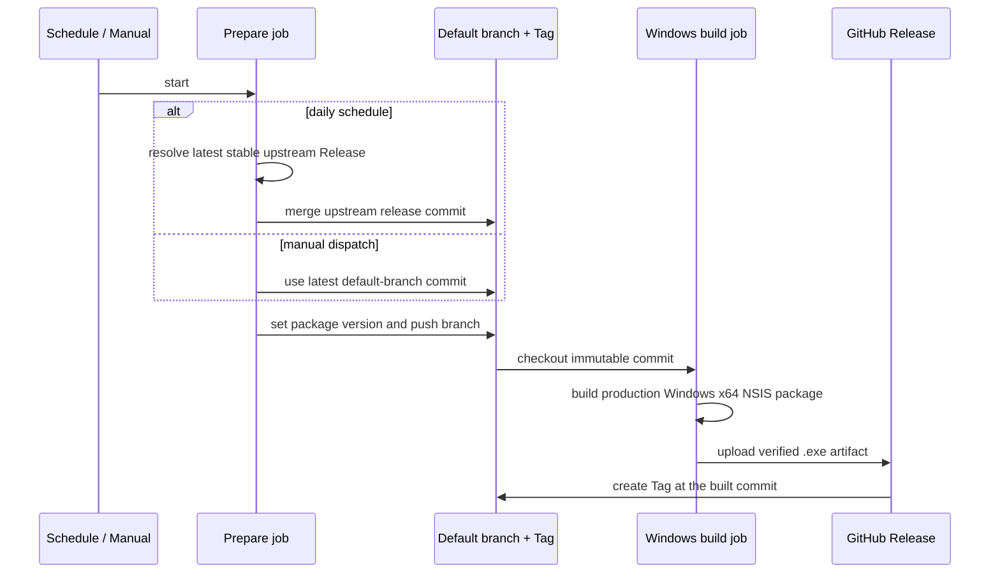

# 上游 Windows Release 同步与打包

## 目标

仓库通过同一个 GitHub Actions workflow 维护 Windows x64 正式安装包：

- 每天检查 `UPSTREAM_REPOSITORY` 指向仓库的最新正式 Release；本仓库尚未发布该 Tag 时，将该 Release 对应提交合并到本仓库默认分支，以相同版本创建 Tag、构建安装包并创建 Release。
- 手动运行时必须输入稳定 SemVer。流程基于本仓库默认分支最新提交更新根 `package.json` 版本，创建发布提交和 Tag，再构建并创建 Release。
- 只构建 `ZCODE_ENV=production` 且 `ZCODE_PREVIEW_IDENTITY=0` 的 Windows x64 NSIS 安装包。

仓库变量 `UPSTREAM_REPOSITORY` 是上游身份的唯一配置入口，格式为 `owner/repository`；未配置时使用 `zai-org/ZCode`。

## 状态所有者与接口

- GitHub 默认分支、Git Tag 和 Release 是发布状态的唯一事实来源；workflow 不维护额外版本缓存。
- 根 `package.json` 是安装包版本的唯一源码来源。准备阶段必须先把它写成去掉 `v` 前缀的目标版本，再创建 Tag。
- 上游最新版本只通过 GitHub Releases API 的 `releases/latest` 获取，因此 draft 和 prerelease 不进入自动发布。
- 本仓库 Release Tag 是幂等键。同名 Release 已存在时自动任务无副作用；同名 Tag 存在但 Release 不存在时拒绝覆盖。

## 事件顺序

准备任务是默认分支写入的唯一 owner，Release 任务是 Tag 与 Release 写入的唯一 owner。`concurrency` 保证同一仓库同一时刻只有一个发布流程；构建任务只消费准备任务输出的不可变 commit。

## 失败语义

- 上游没有正式 Release：自动任务正常结束且不写入任何状态。
- 输入版本不是 `X.Y.Z` 或带前缀的 `vX.Y.Z`：手动任务失败，不允许 prerelease/build metadata。
- 上游仓库格式无效、合并冲突、目标 Tag 已存在、分支保护拒绝推送、构建或上传失败：任务失败，不覆盖已有 Tag 或 Release。
- Release 和 Tag 只在安装包构建并上传成功后创建，因此失败构建不会留下空 Release 或无包 Tag；已同步的分支提交可供后续任务重试。

## 验收场景

1. 上游出现新的稳定 Release，本仓库没有同名 Tag/Release：默认分支合并上游提交，安装包成功后在该构建 commit 创建 Tag，Tag 和安装包版本相同，Release 仅含 Windows x64 `.exe`。
2. 定时任务再次看到已同步的 Release：准备任务输出 `should_build=false`，不构建、不推送。
3. 上游只有 prerelease 或 draft：不会触发自动发布。
4. 手动输入 `3.15.0` 或 `v3.15.0`：根版本均为 `3.15.0`，Tag 均为 `v3.15.0`。
5. 手动输入 `3.15.0-rc.1` 或已存在 Tag：在任何覆盖操作前失败。

## 部署前提

- Workflow 的 `GITHUB_TOKEN` 需要 `contents: write`，仓库 Actions 设置必须允许创建分支提交、Tag 和 Release。
- 默认分支保护若禁止 GitHub Actions 推送，需要显式允许该 workflow/bot；流程不会绕过保护规则。
- 私有上游不在默认令牌权限范围内；如需私有上游，应另行设计最小权限凭据，不能把凭据写入 workflow。
